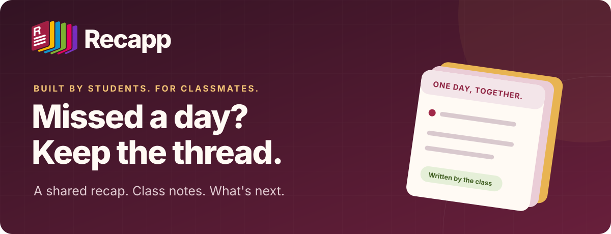

<p align="center">
  
</p>

<h1 align="center">Recapp</h1>
<p align="center"><b>Your school day, written together.</b><br />Catch up with your class. Find the notes. Know what's next.</p>

<p align="center">
  <a href="#project-status"></a>
  <a href="#architecture"></a>
  <a href="#architecture"></a>
  <a href="#architecture"></a>
  <a href="#quickstart"></a>
  <a href="LICENSE"></a>
</p>

<p align="center">
  <a href="https://bassaleo.xyz"><b>↗ Try the demo</b></a>
  &nbsp; · &nbsp; <a href="https://youtu.be/vZPQf7frLNk"><b>▶ Watch the video</b></a>
  &nbsp; · &nbsp; <a href="docs/devpost.md">Our story</a>
  &nbsp; · &nbsp; <a href="docs/README.md">Documentation</a>
  &nbsp; · &nbsp; <a href="docs/credits.md">Credits</a>
</p>

<p align="center"><sub>Built by three Computer Science students in Verona, Italy · <a href="https://csc-back-to-school.devpost.com/">CSC Back-to-School Hackathon</a></sub></p>

---

> **Start here:** open [Recapp](https://bassaleo.xyz) and choose **Try the demo**. No school account needed.

<a id="project-status"></a>

> [!NOTE]
> **A student prototype, with a real school problem behind it.** Recapp is currently being tested by its team. We have discussed the idea with our headteacher; a classroom pilot and school adoption still need to be agreed. The timetables in the prototype do not imply that those classes are already participating.

## 💡 Why Recapp

At our school, information is spread across **ClasseViva**, **Google Classroom** and **Campus**, the school's learning platform. Homework and reminders are not always recorded in the electronic register. After missing a day, a student may need to check several places to find out what happened, what to study and what to bring next time.

Recapp gives classmates a shared starting point. A rotating student note-taker writes a recap after school, adds notes and assignments, and preserves practical details from lab lessons. Students who attended can use it too, to compare notes and see upcoming deadlines together. We hope sharing the responsibility will encourage classmates to help one another.

## ✨ One day, in one place

| View or feature | Purpose |
| --- | --- |
| **☀️ Today** | See the day's lessons, whose turn it is to write and whether the recap has been published. |
| **↶ Yesterday** | Read the latest published day, with subject summaries, notes, attachments and lab details. |
| **📅 Upcoming** | Find homework, tests and events by date; keep a personal checklist on the current device. |
| **📚 By subject** | Revisit recaps for one subject when catching up. |
| **✍️ Write the day** | Start from the timetable, add notes and deadlines, then review and publish. |
| **🧪 Lab blocks** | Record the goal, repository or link, a mistake to avoid and what to bring next time. |
| **💬 Replies and Share** | Suggest corrections under a recap or export a summary image for the class chat. |
| **👥 Class** | Consult members, note-taking turns and the timetable. |
| **🏫 School area** | Provide staff access to class content and administrative tools for class setup and the calendar. |

The interface supports Italian and English, light and dark themes, desktop and mobile layouts, and a guided first-visit tour. **Listen** uses browser speech synthesis where available; playback depends on the browser and installed voices.

### ✍️ A day with Recapp

1. The note-taking turn rotates on school days, using the configured timetable and calendar.
2. After school, the note-taker opens **Write the day**. The timetable pre-fills subjects and lab blocks.
3. They summarize lessons, attach appropriate notes, add reminders and set homework or test dates. Suggested dates can be reviewed and changed.
4. They can paste text or upload a cropped screenshot from a school platform to obtain draft items through the configured extraction provider. Each draft can be accepted, edited or discarded.
5. **Publish** makes the reviewed recap and its items available to the class. If the day remains unpublished after **18:00**, another classmate can take over; the note-taker can also pass the turn earlier.

Recapp does not log into or automatically synchronize the official school platforms. Classmates write the recap, and the official platforms remain the reference for school information.

## 🖼️ A look inside

Screenshots from development illustrate the core workflow; the latest interface may differ.

<p align="center">
  <a href="docs/screenshots/03-ieri-lab.png"></a>
  <br />
  <sub><b>The day, with its context.</b> Subject summaries, lab notes and what to bring next time.</sub>
</p>

<details>
<summary><b>Explore the editor, deadlines and mobile views</b></summary>

| ✍️ Write the day | 📅 See what's next |
| --- | --- |
| [](docs/screenshots/04-editor-giornata.png) | [](docs/screenshots/05-in-arrivo.png) |

<p align="center">
  
  &nbsp;&nbsp;
  
</p>

</details>

<a id="architecture"></a>

## 🧩 Under the hood

| Layer | Implementation |
| --- | --- |
| Frontend | React 19, TypeScript, Vite, Tailwind CSS 4, TanStack Query, React Router, react-i18next |
| Backend | FastAPI, SQLModel, SQLite locally; PostgreSQL supported for deployment |
| Documented hosting setup | Docker on Render, Neon PostgreSQL. Public site: [bassaleo.xyz](https://bassaleo.xyz). [tryrecapp.xyz](https://tryrecapp.xyz) is a second address on the same service while its DNS verification finishes. |
| Extraction | Configurable Featherless text/vision models; offline text parser and simulated image output for local use |
| Background work | Optional Render Workflows `extract_items` task, with in-process execution also supported |
| Speech | Browser Web Speech API |
| Verification tooling | pytest, Playwright, TypeScript production build, oxlint |

AI providers, model identifiers and task execution depend on the environment configuration. The repository supports live AI, but an offline or simulated result is not evidence that a model ran. See [configuration](.env.example), [deployment](DEPLOY.md) and [the extraction pipeline](docs/ai-e-ocr.md).

<details>
<summary><b>Repository map</b></summary>

```text
web/            React interface and browser tests
api/            FastAPI routes, data model, permissions and scheduling
api/tasks.py    Extraction and offline parsing
api/workflow.py Render Workflows entry point
api/tests/      API tests
scripts/        Local development helpers
docs/           Technical documentation, submission and credits
```

</details>

<a id="quickstart"></a>

## 🚀 Run locally

Requirements: Python 3.12, [uv](https://docs.astral.sh/uv/) and Node.js 22+ with npm.

```bash
./scripts/dev.sh
```

The script installs dependencies and starts the API at `http://localhost:8000` and the frontend at `http://localhost:5173`. Local defaults use SQLite, an offline rule-based text parser, simulated image extraction and in-process tasks; no AI key is required. Dependency installation requires network access.

- Select **Try the demo** to explore the sample class.
- Local school-area credentials are `preside` / `demo` at `/scuola`; these are development defaults, not production credentials.
- The development/demo clock can simulate time to explore the daily states.
- On first startup, the console prints class codes and initial admin invitations. Keep invitations private.

<details>
<summary><b>Run the verification checks</b></summary>

After local setup, run the backend checks:

```bash
.venv/bin/python -m pytest api/tests -q
```

Frontend checks:

```bash
cd web
npm run build
npm run lint
npx playwright install chromium ffmpeg
npm run test:e2e
```

Browser-test setup and coverage are described in [web/tests/README.md](web/tests/README.md). Test totals change as the project evolves; use the output from the version being tested rather than a fixed count here.

</details>

## 🔐 Data and access

Class access uses a class code, nickname and personal PIN, with an invitation for initial activation. The application includes authorization checks, hashed PINs and invitations, request limits, and image re-encoding to remove metadata. See [security and privacy](docs/sicurezza-privacy.md) for implementation details and limitations.

Students should not upload grades, private school credentials, names or faces in screenshots. Removing image metadata does not remove information visible in an image. When live extraction is enabled, selected text or images and class context are sent to the configured provider. Review the material before submitting it and check the resulting drafts before publishing.

## 👋 Meet the team

| Team member | Contribution |
| --- | --- |
| [Leonardo Bassanello](https://github.com/xFurti) | Team coordinator, project originator, developer |
| [Luca Cremonese](https://github.com/PiEnneGi) | Developer, beta tester, bug testing |
| [Oleksii Holovan](https://github.com/Oleksi-Holovan) | Developer, beta tester, video creator |

We formed the team on **September 20, 2026**, discussed our ideas with the headteacher on **September 21**, and built Recapp from scratch for the competition. This was our first project together as a team of three. We are particularly proud of translating our ideas into an interface close to what we imagined while coordinating around school, sports and other commitments.

After the competition, we hope to adapt the project with school feedback and agree on a small classroom pilot. School Google-account sign-in is a possible future improvement, not an existing feature. Read the [full project story](docs/devpost.md).

## 🗺️ Where we are going

**Now** → Team testing and hackathon submission.<br />
**Next** → Present the developed project to our headteacher and gather feedback.<br />
**With school agreement** → Try Recapp with two or three classes and adapt it to their needs.

We hope Recapp can help students beyond our own school. Wider adoption and school-account sign-in are future possibilities, not current commitments.

## 🤖 AI, with a human in the loop

Our team supplied the initial ideas and product direction. **Cursor** helped with planning and initial implementation; **Cursor and Claude** supported subsequent development and bug fixes. **Codex** also assisted with implementation, debugging, tests, reviews and documentation. AI contributed substantially to the code. **ChatGPT** helped generate the Recapp logo and some graphics, with some results edited manually by the team.

This development assistance is separate from the app's optional **Featherless** extraction: it prepares draft items for human review and never publishes a recap on its own. The offline parser, simulated image output and browser speech synthesis are also distinct from live generative AI.

See [credits and AI use](docs/credits.md) for roles and asset details. The demo video is on [YouTube](https://youtu.be/vZPQf7frLNk). Oleksii made it with Claude Opus 5.5 and Remotion; Claude also generated the voice and the music, and the app images are real screens from the site.

## 📄 License and credits

The project code is available under the [MIT license](LICENSE). The **ITI G. Marconi Verona logo belongs to the school and is excluded from that license**; the code license grants no permission to reuse it.

Our computer science teacher confirmed that we could display the school logo in this student project. Its presence does not indicate school adoption or an approved pilot. Third-party resources retain their own licenses; see [credits](docs/credits.md).

---

<p align="center"><b>Missed a day? Keep the thread.</b><br /><sub>Made together by Leonardo, Luca and Oleksii.</sub></p>
