# Recapp

**Three school apps. One card. Missed a day? Open yesterday, and see what's due next.**

Built by three 4th-year Computer Science students at ITI G. Marconi, Verona (Italy) for the
[CSC Back-to-School Hackathon](https://csc-back-to-school.devpost.com/). It is a real pilot for
classes 4AI and 4BI, agreed with our headteacher.

Live: https://bassaleo.xyz · Demo: open the site and press **Try the demo** (no account needed).

## The problem

At our school, what happens in class lives in three places that do not talk to each other:

1. **ClasseViva** (the official gradebook): topics, homework, agenda.
2. **Google Classroom**: assignments and files.
3. **Campus**: the school's internal learning content.

None of them is "the truth", so every evening the class chat asks the same questions: *what
homework is there? is there a test? where is the file?* And if you were absent, nobody tells you
what happened **in the lab**: which repo, which command broke, what to bring next time. That
isn't written in any of the three systems.

## What it does

A class hub written by the students who were there, one short card per day:

- **Today**: who is today's note-taker and whether the day is published yet
  (*"Gianni is today's note-taker. The day hasn't been published yet."*), today's lessons
  from the real timetable, and what's due in the next 3 days.
- **Yesterday**: the last published day. Subjects, up to 5 bullet points each, a **lab block**
  (goal, repo, the trap to avoid, what to bring), homework and tests assigned, notes for
  absent classmates. A **Listen** button reads it aloud (Web Speech API).
- **Upcoming**: one flat list of homework, tests, events and labs grouped by date, with a
  countdown on tests and a personal "done" tick stored only on your device.
- **By subject**: every recap of one subject in one view, for catching up after a week off.
- **Replies**: thank the note-taker or flag a correction under the published day.
- **Share**: a card image for WhatsApp with the day's subjects and deadlines (never nicknames).
- **Class**: members, the note-taker rotation (it skips weekends, holidays and school breaks
  from the official Marconi calendar) and the weekly timetable.
- **School area**: the headteacher and staff can see every class, read only.

### Screenshots

| Today: whose turn is it | Yesterday: the day card with lab blocks |
| --- | --- |
| 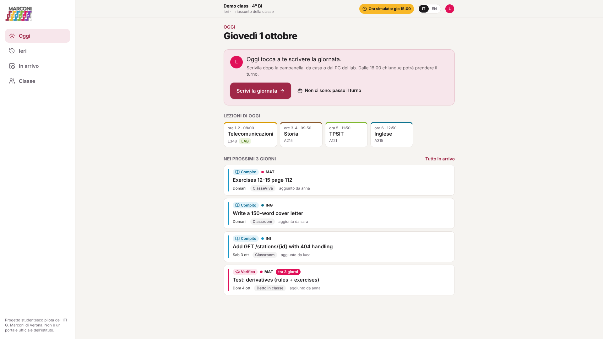 | 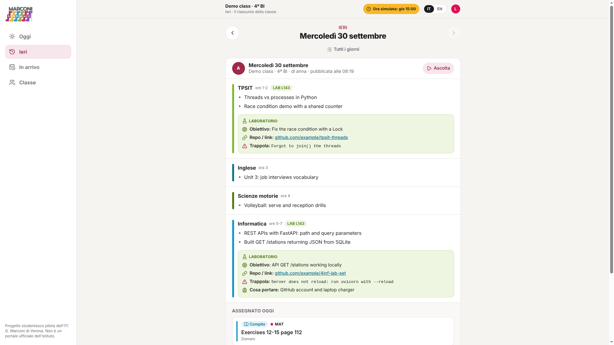 |
| **Write the day: pre-filled from the timetable** | **Upcoming: homework, tests, events** |
| 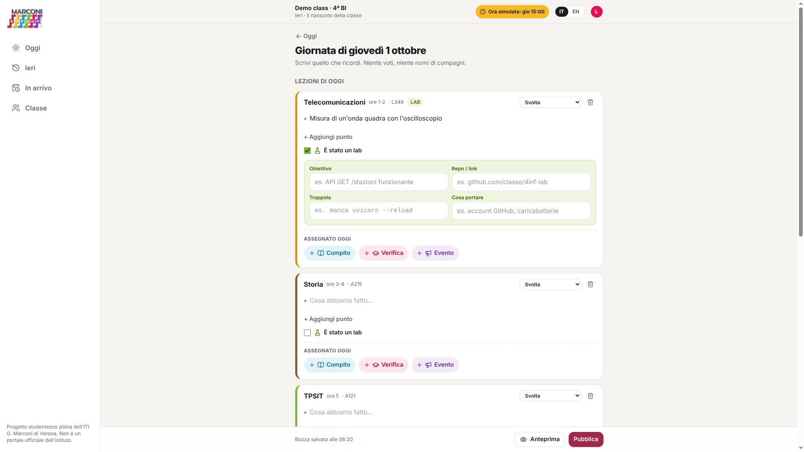 | 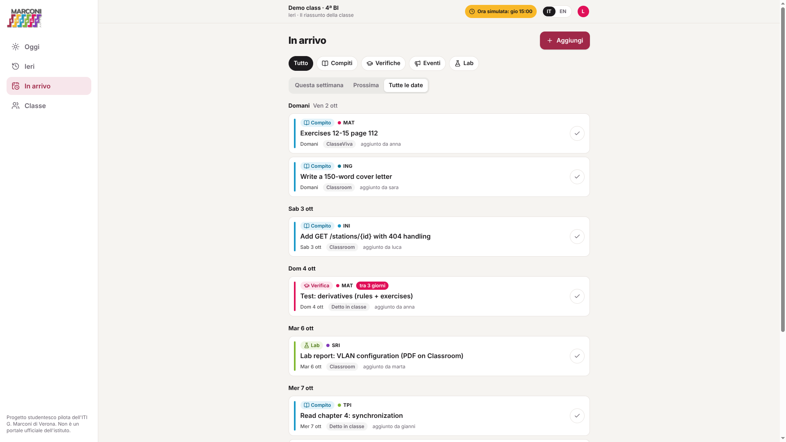 |
| **Note-taker rotation (skips holidays)** | **Real timetable, labs highlighted** |
| 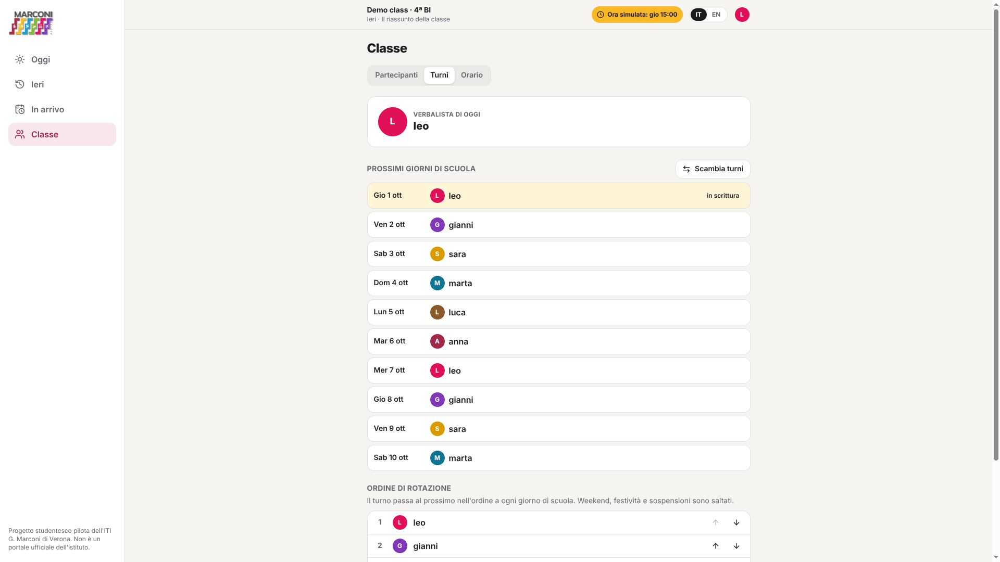 | 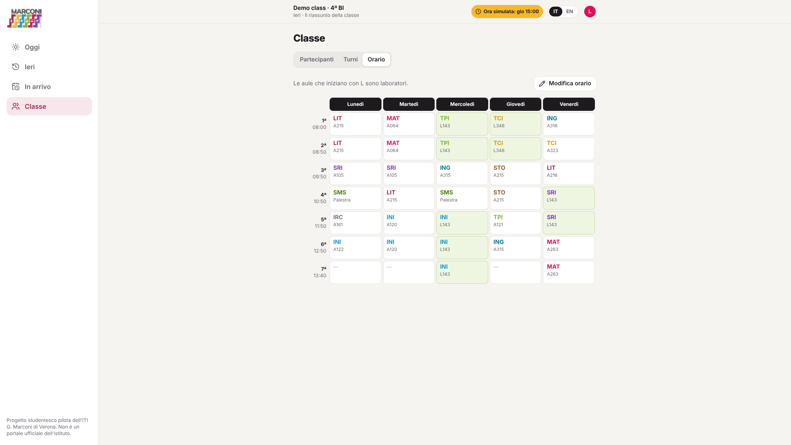 |
| **English UI, 18:30: the turn is open** | **School area for the headteacher** |
| 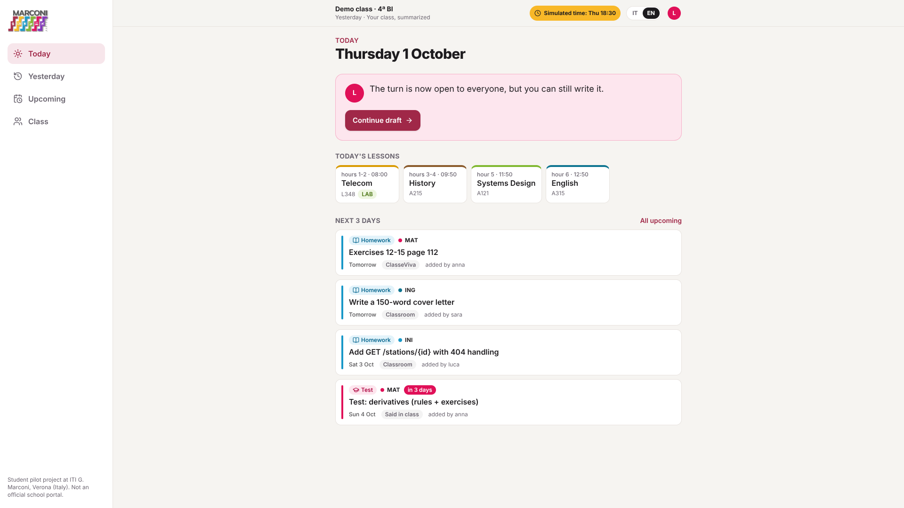 | 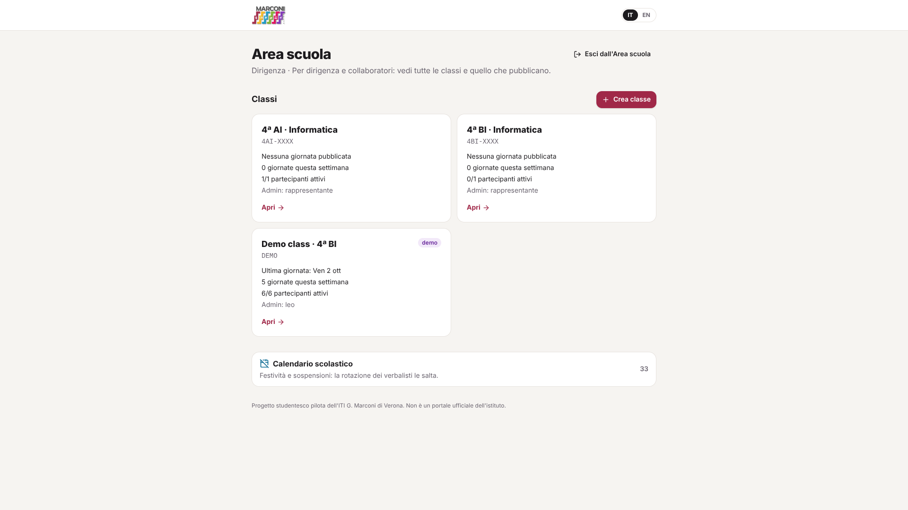 |

<p>
  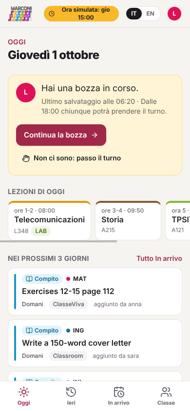
  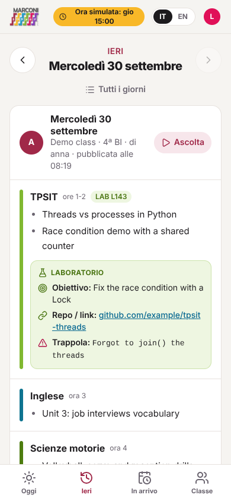
</p>

More: [landing](docs/screenshots/01-landing.png), [members](docs/screenshots/06-classe-partecipanti.png),
[privacy](docs/screenshots/12-privacy.png).

### How a day gets written

1. Every school day the turn rotates to the next member.
2. After the bell, the note-taker opens **Write the day**. The editor is pre-filled from the
   timetable: consecutive hours become one block, and rooms starting with `L` open the lab
   block automatically.
3. Inside each subject, **+ Homework / + Test / + Event** add an upcoming item. The date
   defaults to **the next lesson of that subject**, computed from the timetable and calendar.
4. For things that are already on ClasseViva, Classroom or Campus, the note-taker pastes a line
   ("Math: ex. 12-15, test Fri") or uploads a **cropped screenshot**. AI (Featherless, running
   on Render Workflows) turns it into drafts. **Nothing is published automatically**: the
   note-taker accepts, edits or discards each draft, and dubious dates are highlighted.
5. The draft autosaves, so classmates see "Gianni is writing…". **Publish** makes the day and
   its items visible to the class.
6. If the day isn't published by **18:00**, anyone in the class can **take the turn**. The
   note-taker can also pass it earlier ("I'm away today").

## What we deliberately don't do

- **We don't log into the gradebook.** ClasseViva has no public API for third parties, and
  storing students' school passwords in a public project would be an incident, not a feature.
- No grades, disciplinary notes, absences, diagnoses or photos of faces.
- Students type what they remember. The three official systems remain the source of truth;
  we are the class summary.

## Privacy by design

- Access: class code → pick your nickname → personal 6-digit PIN, set on first login with a
  one-time invite code from the class rep. PINs and invites are bcrypt-hashed; 5 wrong attempts
  lock the nickname for 15 minutes.
- Nicknames only, no surnames. Real classes are readable only by their members and by school
  staff (read only).
- Uploaded crops are re-encoded server-side: EXIF/GPS metadata removed, resized, stored as WebP.
  The upload requires ticking "no grades, names or faces".
- No credentials in the repository. Class codes, invites and PINs never appear in the code.

## Tech

| Layer | Choice |
| --- | --- |
| Frontend | React 19, TypeScript, Vite, Tailwind CSS 4, TanStack Query, react-i18next (Italian / English) |
| Backend | FastAPI, SQLModel, SQLite locally / Postgres (Neon) in production |
| AI | Featherless: `Qwen3-VL-8B-Instruct` for screenshots, `Qwen3-30B-A3B-Instruct-2507` for pasted text |
| Background jobs | **Render Workflows**: the extraction runs as the `extract_items` task, with an in-process fallback |
| Hosting | One Render web service (Docker) serving the app and the API on the same domain, `bassaleo.xyz` from gen.xyz |
| Voice | Browser Web Speech API |
| Quality | 25 pytest tests (also run against Postgres), TypeScript strict build, oxlint |

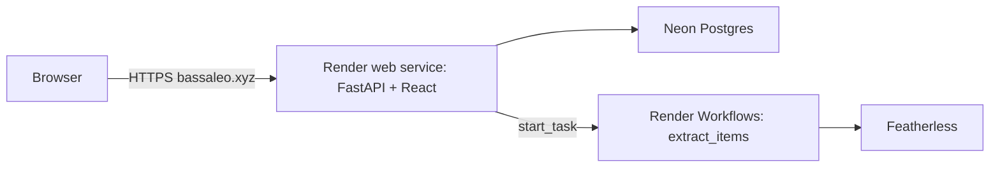

```
web/            React app (pages: Today, Yesterday, Upcoming, Class, Editor, School area)
api/            FastAPI app
  app.py        routes + static app serving
  schedule.py   school days, lessons from the timetable, note-taker rotation
  services.py   day state machine, card save/publish rules
  tasks.py      pure extraction function (mock parser + Featherless), shared with Workflows
  workflow.py   Render Workflows entry point
  seed.py       real 4AI/4BI timetables, 2026/27 calendar, demo class
  tests/        pytest suite
```

## Run it locally

Requirements: Python 3.12 (via [uv](https://docs.astral.sh/uv/)) and Node 22+.

```bash
./scripts/dev.sh
```

This starts the API on http://localhost:8000 and the app on http://localhost:5173. No keys are
needed: SQLite, a rule-based offline parser instead of AI, and tasks run in-process. On first
start the console prints the class codes of 4AI/4BI and one admin invite for each.

- Demo: press **Try the demo**. Every demo nickname also works with PIN `123456`.
- School area: `/scuola`, local credentials `preside` / `demo`.
- In development and in the demo class, the clock button in the top bar simulates the time of
  day, so you can see every state (not started, writing, 18:00 open turn, published, weekend).

Tests:

```bash
.venv/bin/python -m pytest api/tests -q
```

Configuration is documented in [`.env.example`](.env.example); deployment in
[`DEPLOY.md`](DEPLOY.md). Technical documentation for the team (architecture, data model, API,
AI pipeline, security, operations) is in [`docs/`](docs/README.md), written in Italian.

## AI disclosure

We used AI in two different ways and want to be clear about both.

**While building.** We used Cursor, an AI coding assistant, to discuss the plan, write large parts
of the code (backend, React pages, tests, Docker and Render configuration) and debug it. We
decided the product and its rules: the problem, the three layers (class-written now, screenshots
next, official integrations only with the school's permission), the privacy limits, the
note-taker rotation and the 18:00 takeover, what each screen shows. We reviewed the generated
code, ran it, tested it on our real timetables and on the live site with classmates, and fed the
problems we found back into the work (for example a timezone bug and AI prompts that confused
weekdays). We can explain how every part works; the [`docs/`](docs/README.md) folder is our map.

**Inside the product.** The note-taker can ask AI (Featherless models, called from a Render
Workflows task) to turn a pasted line or a cropped screenshot into draft items. Only the cleaned
image (no metadata) and the class context (subjects, dates) are sent; never nicknames. The AI never
publishes: every draft is shown to a human who accepts, corrects or discards it, and dates that
look wrong (weekends, holidays, too far ahead) are flagged. Without an AI key the app uses a
simple rule-based parser instead. The "Listen" button uses the browser's built-in speech
synthesis; it is not generative AI.

## Built with

React · TypeScript · Vite · Tailwind CSS · TanStack Query · react-i18next · FastAPI · SQLModel ·
Pydantic · Pillow · Postgres (Neon) · Docker · Render (web service + Workflows) · Featherless ·
Web Speech API · gen.xyz · Cursor (AI coding assistant)

## Team and credits

Three students of ITI G. Marconi, Verona, 4th year Computer Science: [ name ], [ name ], [ name ].

The ITI G. Marconi logo belongs to the school and is used with its permission for this pilot;
it is not covered by the MIT license of the code.
