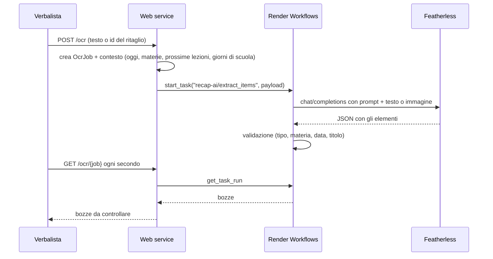

# AI e lettura dei ritagli

## Cosa fa e cosa non fa

L'AI ha un solo compito: trasformare **una riga incollata** o **uno screenshot ritagliato**
(agenda di ClasseViva, compito su Classroom, avviso su Campus) in **bozze** di compiti, verifiche
ed eventi con materia e data. Non pubblica mai niente: il verbalista vede ogni bozza e sceglie
Aggiungi, Modifica o Scarta.

Non scrive la giornata al posto del verbalista, non svolge compiti, non riassume lezioni.

## Percorso

Il codice dell'estrazione (`api/tasks.py`) è una **funzione pura**: riceve tutto nel payload e non
tocca il database. Per questo la stessa funzione gira sia su Render Workflows
(`TASK_RUNNER=render`) sia dentro il web service (`TASK_RUNNER=inline`, o come ripiego automatico
se Workflows non risponde).

## Contesto mandato al modello

- Data di oggi e giorno della settimana.
- Materie della classe con sigla e nome, più le abbreviazioni comuni (mate, info, sistemi, tele…).
- Data della **prossima lezione** di ogni materia, calcolata dall'orario vero.
- Calendario dei prossimi giorni di scuola **con il giorno della settimana**, per risolvere
  "ven", "martedì", "domani".

## Validazione (`validate_drafts`)

Ogni risposta del modello passa da controlli fissi, qualunque sia il modello:

- tipo fuori elenco → `compito`; materia sconosciuta → nessuna materia;
- titolo vuoto → scartato; titolo uguale al tipo ("verifica") → "Verifica di Matematica";
- data mancante, nel passato, oltre 90 giorni o in un giorno senza scuola → `needs_check`,
  evidenziata in giallo con il motivo;
- massimo 10 bozze.

## Modelli scelti

Provati il 1-2 ottobre 2026 con un'agenda finta in stile ClasseViva e righe tipiche della classe:

| Uso | Modello | Risultato | Tempo | Costo concorrenza |
| --- | --- | --- | --- | --- |
| Ritagli | `Qwen/Qwen3-VL-8B-Instruct` | 4/4 corrette | ~19 s | 1 |
| Ritagli (scartato) | `Qwen/Qwen3-VL-30B-A3B-Instruct` | 3/4, una data sbagliata | ~11 s | 2 |
| Righe incollate | `Qwen/Qwen3-30B-A3B-Instruct-2507` | 14/14 dopo il miglioramento del prompt | 4-7 s | 1 |

Il prompt è stato migliorato due volte dopo prove reali: elementi separati sulla stessa riga,
titoli descrittivi, abbreviazioni, calendario con i giorni della settimana. Lezione imparata: il
modello sbaglia soprattutto i giorni della settimana se non gli si dà un calendario esplicito.

## Senza AI

Con `OCR_PROVIDER=mock` (sviluppo) o se Featherless non risponde, le righe incollate passano da un
**parser a regole** (`parse_text`): riconosce materie, tipi, date ("ven", "domani", "6/10",
"tra una settimana", "prossima lezione") e capisce che "es. 3-7" è un intervallo di esercizi e
non il 7 marzo. Per le immagini, in modalità mock, restituisce bozze di esempio dichiarate come tali.

## Privacy dei ritagli

- Prima del caricamento serve la spunta "niente voti, nomi di compagni o volti".
- Il server ricodifica l'immagine: toglie EXIF e posizione, ridimensiona a 1280 px, salva WebP.
- A Featherless arriva solo l'immagine ripulita e il contesto della classe (materie, date):
  nessun nick, nessun dato dei compagni.

## Limiti noti

- I ritagli impiegano fino a 20 secondi: l'interfaccia mostra "Sto leggendo…".
- Screenshot sfocati o tagliati male danno bozze sbagliate: per questo decide sempre una persona.
- I minorenni hanno bisogno del consenso di un genitore ai termini di Featherless.
