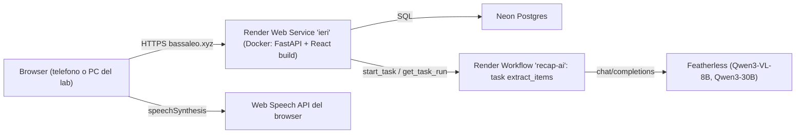

# Architettura

## In una frase

Una sola applicazione web: FastAPI serve sia le API (`/api/...`) sia l'app React già compilata,
sullo stesso indirizzo `https://bassaleo.xyz` (anche `https://tryrecapp.xyz`, sullo stesso servizio). I dati stanno su Postgres (Neon). La lettura dei
ritagli con l'AI gira come task separato su Render Workflows e chiama Featherless.

## Servizi



| Pezzo | Dove | Perché |
| --- | --- | --- |
| Web service | Render, piano Starter, Frankfurt. In dashboard si chiama `recapp`; l'indirizzo resta `ieri.onrender.com` | Sempre acceso (niente attesa di 50 s), cookie per dominio |
| Database | Neon Postgres, piano gratuito | Il disco di Render si azzera a ogni deploy; Neon non scade |
| Workflow `recap-ai` | Render Workflows | Le letture AI durano 5-20 s: fuori dal web service, con retry e log separati |
| AI | Featherless, API compatibile OpenAI | Crediti sponsor, modelli open-weight, nessun dato usato per addestrare |
| Domini | `bassaleo.xyz` (principale, `PUBLIC_URL`) e `tryrecapp.xyz` (secondo indirizzo, in verifica) | Stesso servizio. Se tryrecapp non si verifica, bassaleo resta |

## Percorso di una richiesta

1. Il browser apre `https://bassaleo.xyz/c/4BI-XXXX`. FastAPI non ha una route con quel
   percorso: il gestore dei 404 restituisce `index.html` e React Router mostra la pagina.
2. React chiama `GET /api/classes/4BI-XXXX/today` con il cookie di sessione `ieri_session`.
3. FastAPI verifica la firma del cookie, carica il membro, controlla che sia della classe
   (`class_access`), calcola lo stato della giornata (`DayState`) e risponde in JSON.
4. Le richieste che modificano dati (POST/PUT/PATCH/DELETE) passano anche dal controllo
   dell'header `Origin` (vedi [sicurezza-privacy.md](sicurezza-privacy.md)).

Non c'è CORS perché sito e API hanno la stessa origine.

## Struttura del repository

```
api/                    backend Python (pacchetto `api`)
  app.py                crea l'app FastAPI, middleware, healthz, serve web/dist
  config.py             legge le variabili d'ambiente (Settings)
  db.py                 engine SQLAlchemy (SQLite in locale, Postgres in produzione)
  models.py             tabelle SQLModel
  schemas.py            modelli Pydantic per i dati in ingresso (validazione)
  auth.py               PIN, inviti, cookie firmati, controllo accessi per classe
  schedule.py           calendario scolastico, lezioni dall'orario, rotazione verbalisti
  services.py           regole di dominio: stato della giornata, salva/pubblica card
  images.py             pulizia dei ritagli (EXIF via, resize, WebP)
  tasks.py              estrazione bozze: parser a regole + Featherless (funzione pura)
  jobs.py               esegue l'estrazione inline o su Render Workflows
  workflow.py           entry point del servizio Render Workflows
  school_data.py        orari reali 4AI/4BI, materie, calendario 2026/27
  seed.py               dati iniziali + classe DEMO
  routes/               endpoint divisi per area (auth, classi, card, media, owner)
  tests/                pytest
web/                    frontend React + TypeScript (Vite)
  src/pages/            una pagina per schermata
  src/components/       componenti condivisi (UI, card del giorno, form, shell)
  src/lib/              utility (date, voce, orario simulato, "fatto" locale)
  src/i18n/             testi italiano e inglese
docs/                   questa documentazione
Dockerfile              build in due fasi (Node per il frontend, Python per il backend)
render.yaml             Blueprint del web service
```

## Scelte principali e alternative scartate

| Scelta | Alternativa scartata | Motivo |
| --- | --- | --- |
| I compagni scrivono, noi non ci colleghiamo a ClasseViva | Scraping o login con password Spaggiari | Nessuna API pubblica; salvare password di minorenni in un progetto pubblico è un rischio inaccettabile |
| Un solo servizio per sito e API | Sito statico + API separata | Un dominio, niente CORS, cookie `SameSite=Lax` semplici |
| PIN personale + invito | Login Google della scuola | Gli account Workspace dei minorenni di solito non possono usare app esterne senza l'ok dell'admin. Da valutare con la scuola |
| Rotazione automatica dei verbalisti | Chiunque scrive quando vuole | Senza un responsabile nessuno scrive; con il turno libero dalle 18:00 la giornata non resta vuota |
| AI solo per bozze | AI che pubblica da sola | Le date sbagliate sono il rischio principale: decide sempre una persona |
| SQLModel `create_all` | Migrazioni Alembic | Più semplice per l'hackathon; vedi limiti in [operazioni.md](operazioni.md) |
