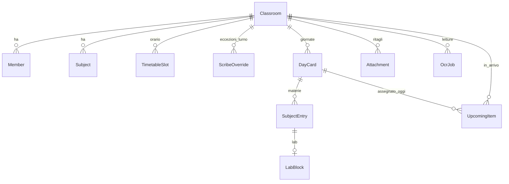
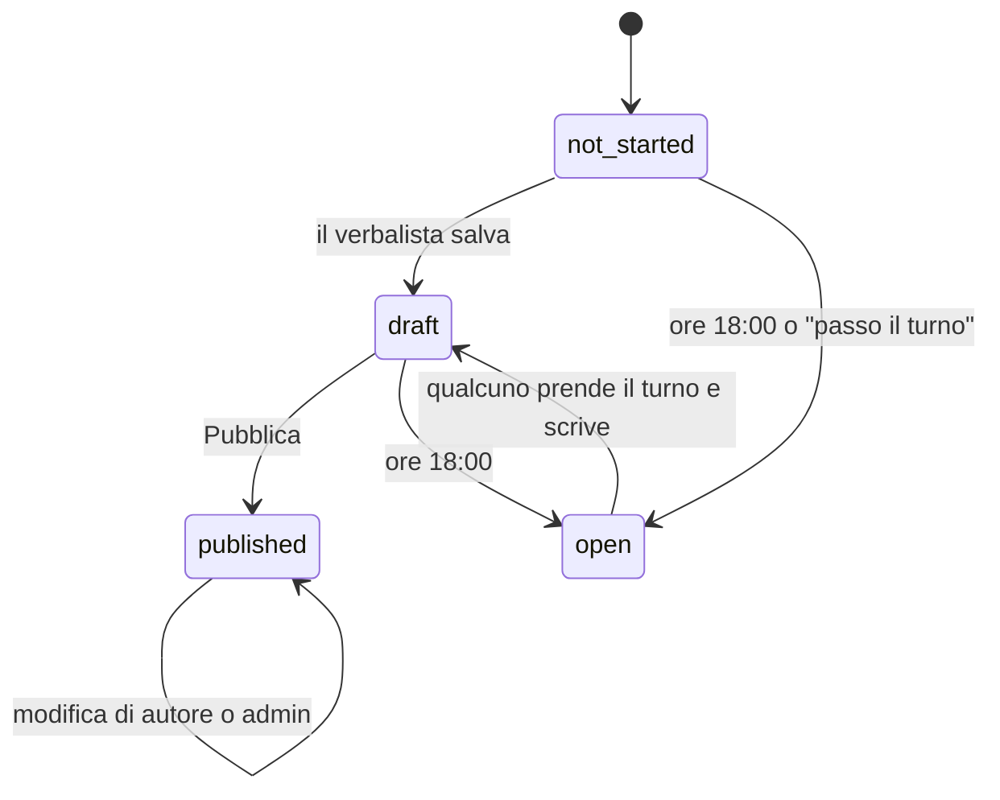

# Backend

FastAPI + SQLModel, Python 3.12. Tutte le date e le ore "di scuola" si calcolano nel fuso
`Europe/Rome`; i timestamp nel database sono in UTC e vengono inviati al browser con il fuso
(`iso_utc`), così il frontend li mostra nell'ora giusta.

## Modello dati

| Tabella | Campi importanti | Note |
| --- | --- | --- |
| `Classroom` | `code` (es. `4BI-K7Q2`), `is_demo`, `rotation_anchor` | Il codice ha un suffisso casuale per non essere indovinato |
| `Member` | `nick`, `role` admin/member, `pin_hash`, `invite_hash`, `activated_at`, `rotation_order`, `failed_attempts`, `locked_until`, `session_version` | `pin_hash` vuoto = deve usare l'invito |
| `Owner` | `username`, `password_hash` | Dirigenza/collaboratori; creato da variabili d'ambiente |
| `Subject` | `code` (INI, MAT…), nomi IT/EN, colore | Per classe, modificabile |
| `TimetableSlot` | `weekday` 0-4, `hour` 1-7, `subject_code`, `room`, `is_lab` | `is_lab` dedotto dall'aula che inizia con `L` |
| `Holiday` | `day`, `label`, `kind` festività/sospensione | Globale per la scuola |
| `ScribeOverride` | `day`, `member_id`, `reason` swap/takeover/pass | Eccezioni alla rotazione |
| `DayCard` | `day`, `status` draft/published, `scribe_member_id`, `author_member_id`, `notes`, `revision` | Una per classe e giorno. `revision` cresce a ogni salvataggio e a ogni cambio di verbalista |
| `SubjectEntry` | `subject_code`, `hours`, `room`, `is_lab`, `lesson_status`, `bullets` (JSON, max 5), `attachment_ids` (JSON, max 3) | Un blocco per materia. `attachment_ids` sono le foto degli appunti |
| `LabBlock` | `goal`, `repo_url`, `pitfall`, `bring` | Legato a un `SubjectEntry` |
| `UpcomingItem` | `type`, `subject_code`, `title`, `due_date`, `due_time`, `source`, `link`, `status`, `card_id` | `draft` finché la card non è pubblicata |
| `Attachment` | `data` (WebP), `width`, `height`, `card_id`, `created_by` | Immagine nel database, mai su disco. Visibile a tutti solo se la card o l'elemento è pubblicato |
| `CardComment` | `card_id`, `member_id`, `kind` comment/correction, `body`, `resolved`, `deleted` | Risposte sotto la giornata pubblicata |
| `CardThanks` | `card_id`, `member_id` (unico per coppia) | Il "Grazie" al verbalista |
| `OcrJob` | `status`, `input_kind`, `result` (JSON), `render_run_id` | Una lettura AI |

## Rotazione dei verbalisti (`schedule.py`)

- **Giorni di scuola**: lunedì-venerdì, dentro l'anno scolastico (10/09/2026 - 08/06/2027),
  esclusi i giorni della tabella `Holiday`. La classe DEMO considera ogni giorno di scuola, così
  la demo funziona anche nel weekend.
- **In rotazione** ci sono i membri attivi che hanno fatto almeno un accesso, ordinati per
  `rotation_order`.
- **Verbalista del giorno D** = `rotazione[indice(D) % N]`, dove `indice(D)` è il numero di giorni
  di scuola tra `rotation_anchor` e D. Weekend e festività non consumano un turno.
- Se per D esiste uno `ScribeOverride`, vince quello: `swap` (scambio deciso dall'admin),
  `takeover` (qualcuno ha preso il turno), `pass` (il verbalista ha rinunciato: nessun responsabile).
- **Prossima lezione** di una materia: primo giorno di scuola successivo in cui l'orario contiene
  quella materia. Serve al pulsante "Prossima lezione" e all'AI per "per la prossima lezione".

Attenzione: se cambia il numero di membri attivi, cambia l'assegnazione dei giorni futuri. È
voluto (chi entra viene inserito nei turni), ma va spiegato ai rappresentanti.

## Stato della giornata (`services.DayState`)

| Stato | Quando |
| --- | --- |
| `no_school` | weekend, festività, fuori anno |
| `future` | giorno non ancora arrivato |
| `published` | card pubblicata |
| `open` | nessun verbalista, oppure dopo le 18:00 (o giorno passato) senza pubblicazione e senza `takeover` |
| `draft` | esiste una bozza |
| `not_started` | nessuna bozza |

Chi può scrivere (`can_write`): un membro, solo in giorni di scuola già arrivati, se è admin o se è
il verbalista **attuale** di quel giorno. L'autore della card può modificarla solo dopo la
pubblicazione. Dopo un takeover, un pass o uno swap, il vecchio verbalista perde la scrittura e la
revisione della bozza cresce di uno: la sua scheda aperta riceve un conflitto o un 403.

Regola anti-vuoto alla pubblicazione: serve almeno un punto, una foto, un blocco lab **con almeno
un campo compilato** o un elemento in arrivo. Un lab vuoto non basta.

## Conflitti di salvataggio

`PUT /cards/{day}` richiede `revision`, la revisione su cui si basa il client. Il server fa un
aggiornamento condizionale atomico (`WHERE revision = :expected`) e risponde **409** con la card
attuale se qualcuno ha salvato nel frattempo. Il frontend mostra un banner con due scelte: tenere
le proprie modifiche o caricare la versione salvata. L'editor parte sempre da una copia fresca del
server, non dalla cache.

## API

Tutte sotto `/api`. Le route `classes/{code}/...` richiedono un membro della classe o un owner.

| Metodo e percorso | Chi | Cosa fa |
| --- | --- | --- |
| `GET /classes/{code}/public` | tutti | Nome classe e nick (per la scelta del nick) |
| `POST /classes/{code}/activate` | tutti | Primo accesso: invito + nuovo PIN |
| `POST /classes/{code}/login` | tutti | Nick + PIN |
| `POST /auth/demo` | tutti | Entra nella DEMO come `leo` |
| `POST /auth/logout`, `POST /auth/change-pin`, `GET /me` | sessione | Sessione |
| `POST /owner/login` | tutti | Login Area scuola |
| `GET /classes/{code}` | membro/owner | Info classe, materie, ruolo di chi guarda |
| `GET /classes/{code}/today` | membro/owner | Stato del giorno, lezioni, verbalista, card, scadenze a 3 giorni |
| `POST /classes/{code}/today/takeover` · `/today/pass` | membro | Prende o passa il turno |
| `GET /classes/{code}/rotation` | membro/owner | Prossimi giorni di scuola con verbalista |
| `PATCH /classes/{code}/rotation/order` · `POST /rotation/swap` | admin/owner | Ordine e scambi |
| `GET` · `PUT /classes/{code}/timetable` | lettura membri, scrittura admin/owner | Orario |
| `GET /classes/{code}/members` | membro/owner | Partecipanti con statistiche |
| `POST /members` · `POST /members/{id}/reset-invite` · `PATCH` · `DELETE /members/{id}` | admin/owner | Gestione partecipanti e inviti |
| `GET /classes/{code}/cards` · `GET /cards/{day}` · `GET /latest` | membro/owner | Elenco giornate, una giornata, ultima pubblicata |
| `PUT /classes/{code}/cards/{day}` · `POST /cards/{day}/publish` | chi può scrivere | Salva bozza (sostituisce tutto) e pubblica |
| `GET` · `POST /classes/{code}/upcoming` · `PATCH` · `DELETE /upcoming/{id}` | lettura tutti, modifica autore/admin | In arrivo |
| `POST /classes/{code}/attachments` · `GET /attachments/{id}` | membro | Carica e mostra un ritaglio. Prima della pubblicazione solo chi l'ha caricato, chi può scrivere la giornata e gli admin |
| `GET /classes/{code}/subjects/{subject}/entries` | membro/owner | Blocchi pubblicati di una materia (settimana, 2 settimane, tutto) |
| `GET /classes/{code}/cards/{day}/feedback` | membro/owner | Commenti, correzioni aperte e conteggio dei "grazie" |
| `POST /classes/{code}/cards/{day}/comments` · `PATCH` · `DELETE /comments/{id}` | membro | Commento o correzione; "risolta" solo autore della giornata o admin; elimina chi l'ha scritta o un admin |
| `POST /classes/{code}/cards/{day}/thanks` | membro | Aggiunge o toglie il proprio "grazie" |
| `POST /classes/{code}/ocr` · `GET /ocr/{job_id}` | membro | Avvia e controlla una lettura AI |
| `GET` · `POST /owner/classes` · `GET` · `POST` · `DELETE /owner/holidays` | owner | Area scuola |
| `GET /healthz` | tutti | Stato, provider OCR, runner |

`PUT /cards/{day}` è un "sostituisci tutto": il frontend manda l'intera giornata, il backend
cancella e ricrea materie e lab, aggiorna gli elementi esistenti (per `id`) e crea i nuovi.

## Configurazione

Tutte le variabili sono descritte in [`.env.example`](../.env.example). Con `APP_ENV=prod`,
`SECRET_KEY` è obbligatoria e la documentazione `/docs` è spenta.

## Seed (`seed.py`)

All'avvio, in modo idempotente:

1. Calendario 2026/27 (solo se la tabella è vuota).
2. Owner da `OWNER_USERNAME`/`OWNER_PASSWORD` (aggiorna la password se cambia).
3. Classi 4AI e 4BI con orario reale, se mancano, e un admin `rappresentante` con invito
   stampato **una sola volta** nei log.
4. Classe DEMO: rigenerata ogni giorno con date relative a oggi (5 giornate passate, 8 elementi).

`python -m api.seed --reset-demo` la rigenera subito.

Nella DEMO le modifiche strutturali sono bloccate lato API (orario, rimozione partecipanti, ruoli,
ordine di rotazione, inviti dei nick di base): la demo è condivisa da tutti i visitatori. Si possono
aggiungere partecipanti (massimo 12) e scambiare i turni. L'OCR della demo ha un budget di 30
letture AI al giorno in totale e 3 al minuto per IP: oltre, risponde il parser a regole.
